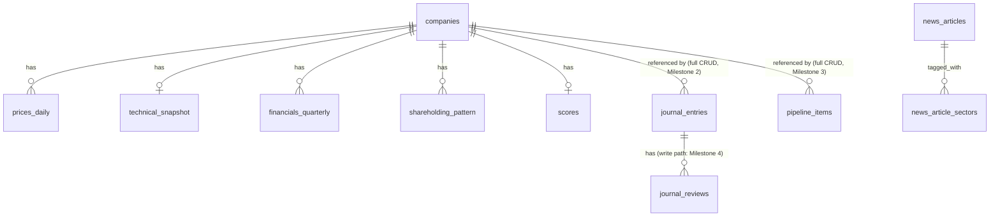

# Architecture

**Purpose:** explain how the system is built, why, and where it should evolve. Reflects the code as of this audit — see `CURRENT_STATE.md` for what's real vs. stubbed within this architecture.

**Audience:** engineers.

---

## 1. System overview

```mermaid
flowchart LR
    subgraph External["External data sources"]
        YF[Yahoo Finance\nvia yfinance]
        KAGGLE[Kaggle CSV export\n(one-time)]
        RSS[RSS feeds\nGoogle News / Moneycontrol / ET / Business Standard]
    end

    subgraph Ingest["Ingest (backend/backend/ingest/, cron via GitHub Actions)"]
        FP[fetch_prices.py]
        CT[compute_technicals.py]
        CS[compute_scores.py]
        SF[seed_fundamentals.py\n(one-time, manual)]
        WNR[weekly_news_refresh.py\n(not scheduled)]
    end

    subgraph DB["PostgreSQL (db/schema.sql)"]
        companies
        prices_daily
        technical_snapshot
        financials_quarterly
        shareholding_pattern
        scores
        journal_entries
        journal_reviews
        pipeline_items
        news_articles
        weekly_sector_intelligence
    end

    subgraph API["FastAPI backend (backend/backend/)"]
        R1["routes/companies.py"]
        R2["routes/discover.py"]
        R3["routes/analysis.py"]
        R4["routes/weekly_intelligence.py"]
        R5["routes/journal.py (Milestone 2)"]
        R6["routes/pipeline.py (Milestone 3)"]
    end

    subgraph FE["React / TanStack Start frontend (frontend/src/)"]
        Discover["/  (Discover / homepage)"]
        Research["/research, /research/$symbol"]
        Screener["/screener"]
        Journal["/journal (full CRUD via routes/journal.py, Milestone 2)"]
        Ideas["/ideas (pipeline, full CRUD via routes/pipeline.py, Milestone 3)"]
    end

    YF --> FP --> prices_daily
    prices_daily --> CT --> technical_snapshot
    financials_quarterly --> CS
    technical_snapshot --> CS --> scores
    KAGGLE --> SF --> financials_quarterly
    KAGGLE --> SF --> shareholding_pattern
    RSS -.never run live.-> WNR -.-> news_articles
    news_articles -.-> weekly_sector_intelligence

    companies --> R1
    prices_daily --> R1
    technical_snapshot --> R1
    financials_quarterly --> R1
    scores --> R1
    scores --> R2
    pipeline_items --> R2
    financials_quarterly --> R2
    technical_snapshot --> R2
    R1 --> R3
    weekly_sector_intelligence -.-> R4
    journal_entries <--> R5
    pipeline_items <--> R6

    R1 --> Discover
    R1 --> Research
    R1 --> Screener
    R2 --> Discover
    R2 --> Ideas
    R3 --> Research
    R4 -.-> Research
    R5 <--> Journal
    R6 <--> Ideas
```

Dotted lines mark paths that are built but not proven to work end-to-end in production (news pipeline). `journal_entries <--> R5` (Milestone 2), `pipeline_items <--> R6` (Milestone 3), and `journal_reviews <--> R5` (Milestone 4) are all bidirectional — every first-party table with a frontend page now has a real write path. `pipeline_items --> R2` (into the grouped `GET /pipeline` read) stays a one-way read arrow, unchanged since Milestone 3.

---

## 2. Backend architecture

**Framework:** FastAPI, single service, no microservices — appropriate for the current scale.

**Layering, as actually implemented (and it's a good pattern — keep it):**

```
routes/*.py      → thin: parse request, call one service function, return
services/*.py    → business logic, SQL queries, one file per module
schemas/*.py     → Pydantic response models
analysis/        → Module 6's deterministic rule engine (engine.py + rules/*.py)
ingest/          → standalone scripts run by cron, not by the API process
db/db.py         → SQLAlchemy engine/session setup
db/schema.sql    → hand-maintained DDL, run manually, not via a migration tool
```

This separation is consistently followed and is the strongest part of the codebase. `company_service.py`'s own docstring states the discipline explicitly: routes stay thin, and every list/detail query is bounded to a small fixed number of round trips regardless of universe size. Preserve this pattern as the system grows.

**What's missing at the architecture level, not just the implementation level:**

- **Journal write layer — done, Milestone 2 (`journal_entries`) and Milestone 4 (`journal_reviews`).** `routes/journal.py` / `routes/journal_reviews.py` (thin) → `services/journal_service.py` / `services/journal_review_service.py` (business logic + SQL) → `schemas/journal.py` / `schemas/journal_review.py`, following `company_service.py`'s pattern exactly. Both first-party journal tables now have a real write layer.
- **Pipeline write layer — done, Milestone 3.** `routes/pipeline.py` (thin) → `services/pipeline_service.py` (business logic + SQL, plus a dedicated stage-move operation) → `schemas/pipeline.py`, mirroring the journal pattern exactly. The pre-existing grouped `GET /pipeline` in `routes/discover.py`/`discover_service.py` is untouched except for one additive field (`id` on each item, needed so the frontend can address a row) — the new module is purely additive alongside it, not a replacement.
- **No migration tooling.** `db/schema.sql` uses `create table if not exists` plus manually appended `alter table add column if not exists` statements as a hand-rolled idempotent migration strategy. This works today at low table count but has no rollback story and no versioning — see `TECHNICAL_DEBT.md` TD-014.
- **No auth layer.** `user_id` columns are nullable placeholders throughout, including on `journal_entries` (every row currently written has `user_id = null`). Fine for a single user; will need real design before "a few friends" is anything more than a shared login.

---

## 3. Frontend architecture

**Framework:** React 19, TanStack Router + TanStack Start (SSR), Tailwind, shadcn/ui component set, TanStack Query for data fetching, deployed to Cloudflare Workers.

**Structure (as of Milestone 1, the only structure in the repo):**

```
src/routes/                  -- file-based routing (index, research, research.$symbol, screener, journal, ideas)
src/features/<domain>/
    api/                     -- fetch functions per domain (companies.ts, market.ts, journal.ts)
    api/mock/                -- mock data, used when no live API configured
    hooks/                   -- TanStack Query hooks per domain
    components/              -- domain-specific components
src/shared/
    api/                     -- client.ts, types.ts (canonical response shapes)
    components/ui/           -- shadcn primitives
    components/common/       -- cross-domain components (Badge, PageHeader, EmptyState, ...)
    components/layout/       -- AppShell, CommandPalette
    hooks/                   -- queryKeys.ts and cross-cutting hooks
```

**Dead structure removed in Milestone 1 (and re-confirmed/re-removed in Milestone 2 — see `CURRENT_STATE.md` §3):** `src/components/**` (duplicate shadcn `ui/` set + duplicate company components), `src/hooks/**` (duplicate hooks, including a duplicate `queryKeys.ts` that had previously caused a broken-import bug — see `CHANGELOG.md`'s historical Module entries), and `src/lib/api/**` (duplicate API client + duplicate mock data) were confirmed to have zero live imports and deleted, along with `src/lib/mock-data.ts` and `src/lib/utils.ts`, which became orphaned once their only importer (the deleted `components/` tree) was removed. See `TECHNICAL_DEBT.md` TD-002 (resolved) and `CHANGELOG.md` for both milestones' entries.

**Data flow discipline (worth preserving as a hard architectural rule):** *"React never screens, ranks, filters, or calculates. FastAPI does."* The frontend fetches, displays, and handles client-side pagination/sort of already-server-filtered data. This rule is also stated in `ENGINEERING_GUIDE.md` §7 as a hard constraint for new code.

---

## 4. Database

See `db/schema.sql` directly for full DDL; summarized here by concern:



**Design pattern worth keeping:** raw data (`prices_daily`, `financials_quarterly`) is separated from derived data (`technical_snapshot`, `scores`), and derived tables are explicitly recomputable, never hand-edited. This means indicator/scoring logic can change without re-fetching source data — a genuinely good decision, credited in `DECISIONS.md` ADR-004.

**Design gap:** `financials_quarterly` is modeled as a time series (`primary key (symbol, quarter)`) but every current consumer (`ingest/compute_scores.py`, `services/company_service.py`) only ever reads the single row where `quarter = 'latest'`, via `order by updated_at desc limit 1`. The table supports trend analysis; nothing uses it that way yet. This is both a current limitation and the cheapest possible win for `SCORING_ENGINE.md`'s earnings-quality factor.

---

## 5. Deployment

- **Frontend:** TanStack Start SSR, built for and deployed to Cloudflare Workers (`frontend/.output/server/wrangler.json`).
- **Backend:** FastAPI, presumed to run as a standalone process (no Dockerfile or deployment config found in the audited zip beyond the app itself) — deployment target for the API is not currently documented anywhere in the repo. This is a gap; see `TECHNICAL_DEBT.md` TD-006.
- **Data refresh:** GitHub Actions, `.github/workflows/ingest.yml`, weekdays 18:00 UTC, running `fetch_prices` → `compute_technicals` → `compute_scores` against a `DATABASE_URL` secret.

**Where this should evolve:** for a single-user tool, SSR/edge deployment is solving a problem (multi-user latency at global scale) that doesn't exist yet. Recommendation, detailed in `DECISIONS.md` ADR-010 and `ENGINEERING_ROADMAP.md`: move to a static SPA build against the same FastAPI backend, hosted on the simplest possible platform, until there's an actual multi-user reason to bring SSR back.

---

## 6. Where the architecture should evolve (summary — see roadmaps for sequencing)

1. ~~Add a real write layer (`routes/journal.py`, `services/journal_service.py`)~~ — **done, Milestone 2**, for `journal_entries`. ~~`routes/pipeline.py`-style mutations for `pipeline_items`~~ — **done, Milestone 3**. ~~`journal_reviews` write path~~ — **done, Milestone 4**. Every first-party writable module now has a real write layer.
2. Introduce a minimal migration tool (even a numbered SQL file convention) once the schema starts changing more than a few times a year — not urgent yet, but the current `alter table ... if not exists` pattern won't scale past a handful of changes without becoming unreadable.
3. Add a pure-function test suite for `scoring_service.py` and `analysis/rules/*` before either changes further (`TECHNICAL_DEBT.md` TD-005) — the frontend directory consolidation this item used to describe was completed in Milestone 1. `journal_service.py` (Milestone 2) and `pipeline_service.py` (Milestone 3) are now also untested — see TD-018/TD-019.
4. Simplify deployment away from SSR/edge until multi-user need is real.
5. Turn `financials_quarterly` into an actually-queried time series once `SCORING_ENGINE.md`'s v2 factors need it.
6. ~~Build `journal_reviews` write path once a future milestone picks it up~~ — **done, Milestone 4** (`TECHNICAL_DEBT.md` TD-017, resolved).
